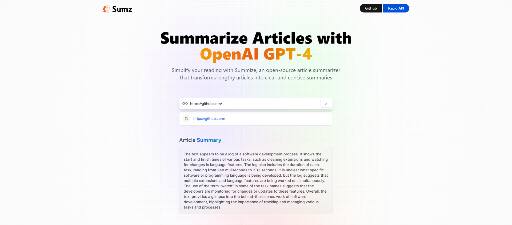

# GPT-4 Summarizer Web

A well-designed article summarizer web application using OpenAI's GPT-4 model powered by Rapid API — built with React & Redux.js.

---

## 🗂️ Table of Contents

- [About the Project](#about-the-project)
- [Folder Structure](#folder-structure)
- [Tech Stack](#tech-stack)
- [Getting Started](#getting-started)
  - [Environment Variables](#environment-variables)
  - [Installation](#installation)
  - [Run Locally](#run-locally)
- [Acknowledgements](#acknowledgements)

---

## ⭐ About the Project

This repository houses a well-designed Article Summarizer Web Application built with React & Redux.js using OpenAI's GPT-4 model powered by Rapid API 🤖



---

## 📁 Folder Structure
Here is the folder structure of GPT4 Summarizer Web.
```bash
GPT4-Summarizer-Web/
|- public/
|- src/
  |-- assets/
    |-- {...}.svg
    |-- index.js
  |-- components/
    |-- Demo.jsx
    |-- Hero.jsx
    |-- index.js
  |-- services/
    |-- article.js
    |-- store.js
  |-- App.css
  |-- App.jsx
  |-- main.jsx
|- .env
|- .eslintrc.cjs
|- index.html
|- package.json
|- postcss.config.js
|- tailwind.config.js
|- vite.config.js
```
<br />

<!-- TechStack -->
### :space_invader: Tech Stack

[](https://skillicons.dev)

<p align="right">(<a href="#readme-top">back to top</a>)</p>

<!-- Getting Started -->
## :toolbox: Getting Started

<!-- ENV VARIABLES -->
### :key: Environment Variables

In order to use this GPT4 Summarizer Webapp you have to add some environment variables to .env file,

create `.env` file in root folder & add the following environment variable:
```env
VITE_RAPID_API_KEY=<RAPID_API_KEY>
```

<!-- Installation -->
### :gear: Installation

#### Step 1:
Download or clone this repo by using the command below:

```bash
 https://github.com/TusharC19/Sumz/tree/main
```

#### Step 2:

This webapp using NPM (Node Package Manager), therefore, make sure that Node.js is installed by execute the following command in console:

```bash
  node -v
```

#### Step 3:

In root folder execute the following command to get the required packages:

```bash
  npm install
```

<!-- Run Locally -->
### :running: Run Locally

#### Step 1:

Go to root folder and execute the following command in order to run the webapp:

```bash
  npm run dev
```
<!-- Acknowledgments -->
## :gem: Acknowledgements

This section used to mention useful resources and libraries that used in the GPT4 Summarizer Webapp:

#### client-side

- [Vite.js](https://vitejs.dev/)
- [React](https://react.dev/)
- [Redux Toolkit](https://redux-toolkit.js.org/)
- [React Redux](https://react-redux.js.org/)
- [TailwindCSS](https://tailwindcss.com/)
- [Rapid API](https://rapidapi.com/)
- [Google Fonts](https://fonts.google.com/)
- #JSMastery

<p align="right">(<a href="#readme-top">back to top</a>)</p>
